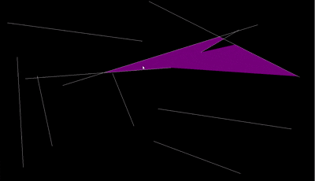

# Very Basic Ray Tracing  
_Note: running this script requires SFML 2.6.1 to be linked_

## Overview
Send out rays from your mouse and see how they interact with the randomly placed light barriers. The code certainly isn't perfect, but it was a means for me to start learning C++ in high school and is no longer reflective of my current C++ skill level.

## List of Controllable Settings:
- Intensity of the rays: `mouse1`/`mouse2`
  * You can increase/decrease the intensity/opacity of the rays by clicking `mouse1`/`mouse2`
- Ray Length: `W`/`S`
  * You can increase/decrease the length of the rays by clicking `W`/`S`
- Ray Color: `R`/`G`/`B`
  * Pressing `R`/`G`/`B` will increase the respective color channel's value and loops back to 0 once value exceeds 255 

## Video Example

